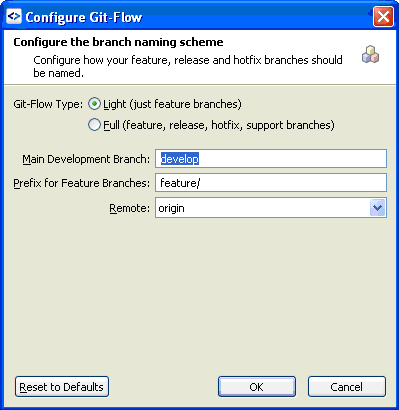
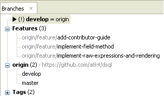
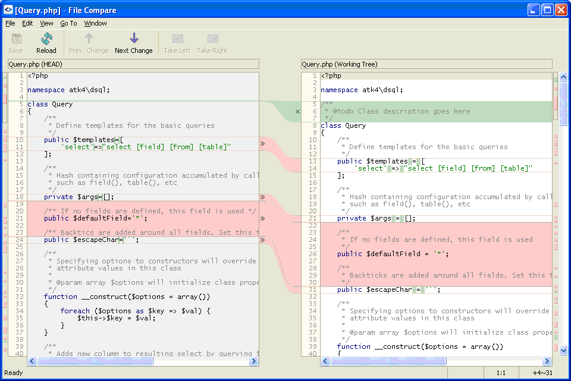
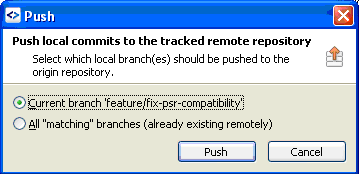
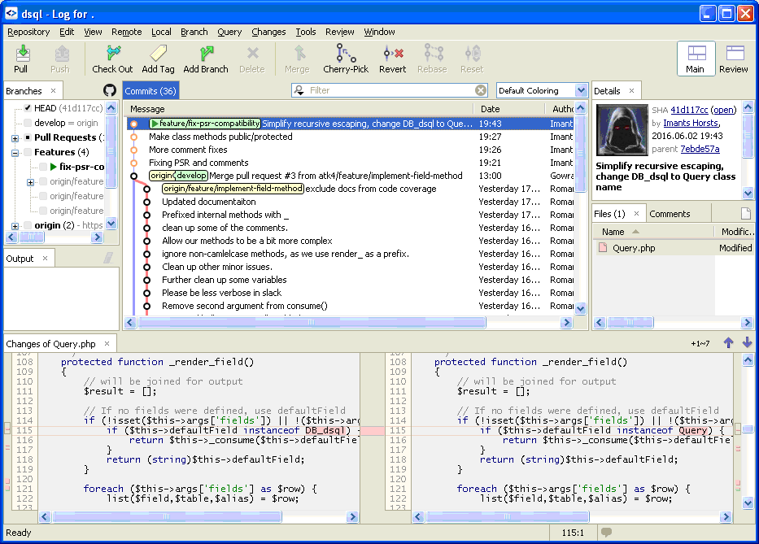

# Contributor Guide

Do not hesitate to contribute to DSQL. We have made it safe and simple for you to contribute and if your contribution is not ideal, the rest of the team will help you to finalize it. You must follow the guidelines below.

## Cloning and Installing Locally

 - Use `git clone` before doing any changes instead of ZIP distribution.
 - install `git flow`, I recommend getting a refined version from here: http://github.com/petervanderdoes/gitflow
 - execute `git flow init`
 - Read http://danielkummer.github.io/git-flow-cheatsheet/ explaining basic workflow. Focus on "feature" section.

## Planning your change

 - if you are renaming internal methods, note your changes into CHANGES.md file
 - if you performing major changes (which may affect developers who use DSQL), discuss in Slack #dsql first.

## Creating your own feature or fix

 - decide what feature you're working. Use prefix "add-" or "fix-". Use dashes instead of spaces.
 - make sure your branch is consistent with other branches. See [https://github.com/atk4/dsql/branches/all](https://github.com/atk4/dsql/branches/all)
 - execute `git feature start fix-psr-compatibility`. If you already modified code, `git stash` it.
 - use `git stash pop` to get your un-commited changes back
 - install and execute `phpunit` to make sure your code does not break any tests
 - update or add relevant test-cases. Remember that Unit tests are designed to perform low-level tests preferably against each method.
 - update or add documentation section, if you have changed any behavior. RST is like Markdown, but more powerful. [http://docutils.sourceforge.net/docs/user/rst/quickref.html](http://docutils.sourceforge.net/docs/user/rst/quickref.html)
 - see [docs/README.md](docs/README.md) on how to install "sphinx-doc" locally and how to make documentation.
 - open docs/html/index.html in your browser and review documentation changes you have made
 - commit your code. Name your commits consistently. See [https://github.com/atk4/dsql/commits/develop](https://github.com/atk4/dsql/commits/develop)
 - use multiple comments if necessary. I recommend you to use "Github Desktop", where you can even perform partial file commits.
 - once commits are done run `git feature publish fix-psr-compatibility`. 
 
## Create Pull Request

 - Go to [http://github.com/atk4/dsql](http://github.com/atk4/dsql) and create Pull Request
 - In the description of your pull request, use screenshots of new functionality or examples of new code.
 - Go to #dsql on our Slack and ask others to review your PR.
 - Allow others to review. Never Merge your own pull requests.
 - If you notice that anything is missing in your pull-request, go back to your code/branch, commit and push. Changes will automatically appear in your pull request.
 - Clean up your repository. Follow this guide: [http://railsware.com/blog/2014/08/11/git-housekeeping-tutorial-clean-up-outdated-branches-in-local-and-remote-repositories/](http://railsware.com/blog/2014/08/11/git-housekeeping-tutorial-clean-up-outdated-branches-in-local-and-remote-repositories/)

## If you do not have access to commit into atk4/dsql

 - Fork atk4/dsql repository.
 - Follow same instructions as above, but use your own repository name
 - If you contribute a lot, it would make sense to [set up codeclimate.com for your repo](https://codeclimate.com/github/signup). 
 - You can also enable Travis-CI for your repository easily.

## Verifying your code

 - Once you publish your branch, Travis will start testing it: [https://travis-ci.org/atk4/dsql/branches](https://travis-ci.org/atk4/dsql/branches)
 - When your PR is ready, Travis will run another test, to see if merging your code would cause any failures: [https://travis-ci.org/atk4/dsql/pull_requests](https://travis-ci.org/atk4/dsql/pull_requests)
 - It's important that both tests are successful
 - Once your branch is public, you should be able to run Analyze on CodeClimate: [https://codeclimate.com/github/atk4/dsql/branches](https://codeclimate.com/github/atk4/dsql/branches) specifically on your branch.

## For Windows and UI lovers :)

### Tool for the job - SmartGit

If you’re working on Windows and preffer using UI, then you can do like this:

 - Install SmartGit. It has impressive functionality and it’s free for non-commercial use. You can install it from here [Download SmartGit](http://www.syntevo.com/smartgit/download)
 - Open SmartGit and create new repository by cloning it from github - menu /Repository/Clone.
 - - Remote Git or SVN repository to clone = https://github.com/atk4/dsql
 - - Set master password
 - - Include Submodules and Fetch all Heads and Tags
 - - Set local directory where you want this repository to reside.
 - - Click finish and after some seconds atk4/dsql repository will be cloned to your local disk.
 - Configure Git-Flow like this:

 - Now you should see all feature branches grouped in Features folder like this:

 - Create new feature branch for your changes.
 - - Click Git-Flow icon in toolbar and choose Start Feature.
 - - Name your new feature, for example, fix-psr-compatibility
Keep in mind that you don’t have to add feature/ prefix because it’s added automatically. Avoid using spaces and strange symbols in name of your branch.
 - - Click Start and your new branch will be created and made active one.
 - Make your changes in your local repository by using your favorite PHP editor.
 - Don’t forget to update PHPUnit tests and Documentation!

### Commiting your changes

 - When you finish particular part of your planned changes, then you should commit them. Don’t forget to add short description of your changes.
 - Select your repository (dsql) and click Commit in top toolbar.
 - You’ll see all files you have changed in a list. By double clicking on file new window will open where you can see all changes you have made.

 - If everything is OK, then enter description of commit in Commit Message textbox and click Commit.
 - You can make unlimited amount of commits in your branch, but keep in mind that feature branch is meant only for particular task and there shouldn’t be 100 commits otherwise it’ll be harder to merge it into main repository branch later.

### Pushing you feature branch to github

 - When you’re ready to push your feature branch to githib, then click Push in top toolbar, choose "Current branch ‘name-of-your-branch’" and click Push.

### Finishing feature – DON'T DO THAT YOURSELF !
You should not click Git-Flow / Finish, because then your feature branch will be merged into main develop branch of repository. Of course that's if you have appropriaate permissions there.

### Additional features of SmartGit
There are really a lot of cool features in SmartGit. Check it out. And if you’re not 101% command line geek I guess you’ll like it.

and there are a lot more ...
